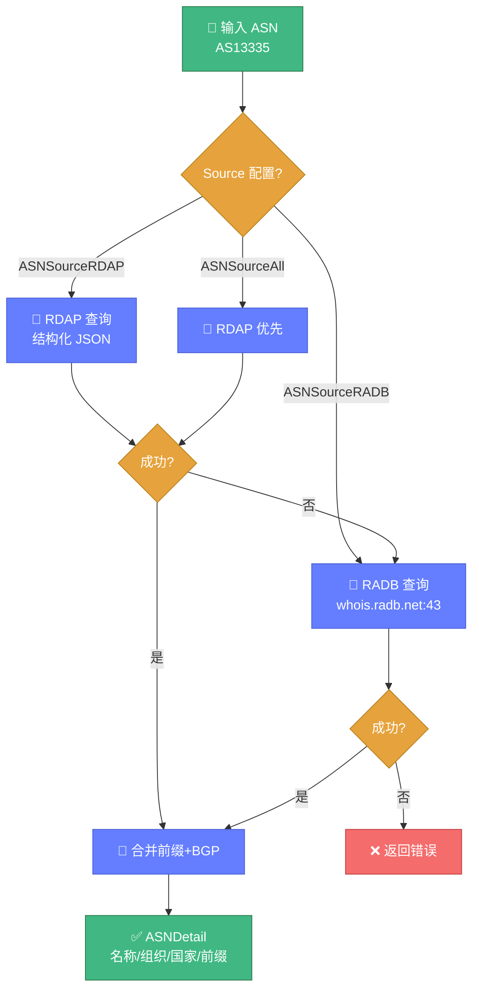

# 🔢 ASN 查询教程

> 📖 查询自治系统号（ASN）的归属、前缀与 BGP 关系。

---

## 1️⃣ 基础查询

```go
package main

import (
	"context"
	"fmt"

	"github.com/cyberspacesec/whois-skills/pkg/whois"
)

func main() {
	detail, err := whois.QueryASN(13335) // Cloudflare
	if err != nil {
		panic(err)
	}

	fmt.Printf("ASN: AS%d\n", detail.ASN)
	fmt.Printf("名称: %s\n", detail.Name)
	fmt.Printf("组织: %s\n", detail.Organization)
	fmt.Printf("国家: %s\n", detail.Country)
	fmt.Printf("RIR: %s\n", detail.RIR)
	fmt.Printf("IPv4 前缀数: %d\n", len(detail.IPv4Prefixes))
	fmt.Printf("IPv6 前缀数: %d\n", len(detail.IPv6Prefixes))
}
```

`QueryASN` 默认使用 `ASNSourceAll`（RDAP 优先，失败回退 RADB），并包含前缀。

下图展示了 ASN 查询的 RADB + RDAP 双源获取流程：



---

## 2️⃣ 指定数据源

三种数据源：

| 数据源 | 常量 | 特点 |
|--------|------|------|
| RADB | `ASNSourceRADB` | 通过 `whois.radb.net:43`，含前缀 |
| RDAP | `ASNSourceRDAP` | 现代协议，结构化 |
| 全部 | `ASNSourceAll` | RDAP 优先，回退 RADB |

```go
ctx := context.Background()
detail, err := whois.QueryASNWithContext(ctx, &whois.ASNQueryOptions{
	ASN:             15169, // Google
	Source:          whois.ASNSourceRDAP,
	IncludePrefixes: true,
	IncludeBGP:      true,
	Timeout:         10,
})
```

---

## 3️⃣ BGP 关系

开启 `IncludeBGP` 可获取上下游与对等 ASN：

```go
detail, _ := whois.QueryASNWithContext(ctx, &whois.ASNQueryOptions{
	ASN:        13335,
	IncludeBGP: true,
})

fmt.Println("上游 ASN:", detail.UpstreamASNs)
fmt.Println("下游 ASN:", detail.DownstreamASNs)
fmt.Println("对等 ASN:", detail.PeerASNs)
```

::: warning ⚠️ BGP 数据
BGP 关系数据依赖第三方数据源，可能不完整。当前实现侧重结构定义，实际填充视数据源而定。
:::

---

## 4️⃣ 解析 ASN 字符串

支持多种格式输入：

```go
n, _ := whois.ParseASNString("AS13335")  // 13335
n, _ = whois.ParseASNString("as13335")    // 13335
n, _ = whois.ParseASNString("13335")      // 13335
```

---

## 5️⃣ 批量查询

并发查询多个 ASN：

```go
ctx := context.Background()
batch := whois.BatchQueryASN(ctx, []int{13335, 15169, 32934}, 10)
// 并发度 10

fmt.Printf("总计: %d, 成功: %d, 失败: %d\n",
	batch.TotalQueried, batch.SuccessCount, batch.FailureCount)

for asn, detail := range batch.Results {
	fmt.Printf("AS%d: %s\n", asn, detail.Name)
}
for asn, err := range batch.Errors {
	fmt.Printf("AS%d 失败: %v\n", asn, err)
}
```

---

## 6️⃣ 前缀统计

```go
ipv4Count, ipv6Count := whois.ASNToPrefixCount(detail)
fmt.Printf("IPv4 前缀: %d, IPv6 前缀: %d\n", ipv4Count, ipv6Count)
```

---

## 7️⃣ 仅查前缀（RADB）

如果只需要 IP 前缀列表，用基础 `asn.go`：

```go
ipv4, ipv6, err := whois.GetIPRangesByASN("AS13335")
fmt.Println("IPv4 前缀:", ipv4)
fmt.Println("IPv6 前缀:", ipv6)
```

---

## 8️⃣ RDAP 查询 ASN

```go
result, _ := whois.QueryRDAP_ASN("AS13335")
fmt.Printf("名称: %s\n", result.Name)
fmt.Printf("国家: %s\n", result.Country)
fmt.Printf("起始: %d\n", result.StartAutnum)
fmt.Printf("结束: %d\n", result.EndAutnum)
```

---

## 9️⃣ 缓存管理

ASN 查询结果会缓存，可查看与清理：

```go
// 查看缓存
cache := whois.GetASNDetailCache()
fmt.Printf("缓存 ASN 数: %d\n", len(cache))

// 清空缓存
whois.ClearASNDetailCache()
```

---

## 🔟 HTTP API 调用

```bash
curl -X POST http://127.0.0.1:8080/api/asn \
  -H "Content-Type: application/json" \
  -d '{"asn":13335,"source":"all","include_prefixes":true,"include_bgp":false}'
```

📖 详见 [ASN 端点](../api/http/endpoint-asn.md)。

---

## ✅ 小结

| 需求 | 推荐方式 |
|------|---------|
| 简单查 ASN | `QueryASN` |
| 指定数据源 | `QueryASNWithContext` + Source |
| 批量查询 | `BatchQueryASN` |
| 仅前缀 | `GetIPRangesByASN` |
| 现代 RDAP | `QueryRDAP_ASN` |

---

## 🔗 下一步

- 🚀 [asn_enhanced.go API](../api/whois/asn-enhanced.md)
- 🔢 [asn.go API](../api/whois/asn.md)
- 📡 [RDAP 文档](../api/whois/rdap.md)
