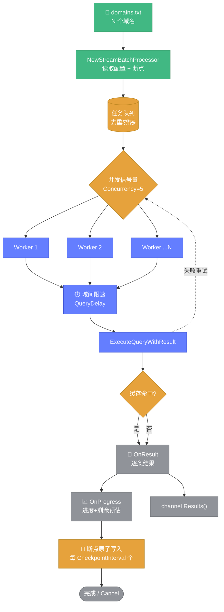
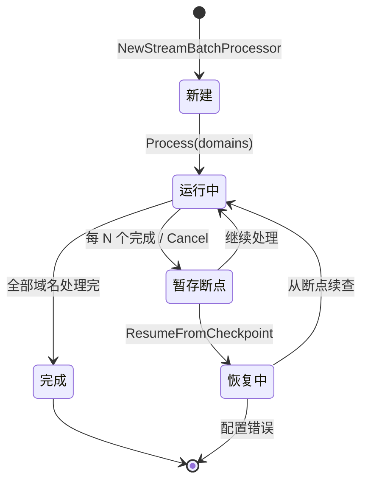

# 📋 批量查询教程

> 📖 流式批量查询大量域名，支持断点续查、并发限速、进度回调。

---

## 🎯 为什么用 StreamBatchProcessor

`QueryAggregator` 适合少量并发（<100 域名），但当你需要：

- ✅ 查询**成百上千**个域名
- ✅ **断点续查**（中断后从上次位置继续）
- ✅ **域间限速**（避免触发封禁）
- ✅ **实时进度**与**剩余时间预估**
- ✅ **流式结果**（边查边消费）

就用 `StreamBatchProcessor`。



---

## 1️⃣ 基础用法

```go
package main

import (
	"context"
	"fmt"
	"os"

	"github.com/cyberspacesec/whois-skills/pkg/whois"
)

func main() {
	// 读取域名列表
	data, _ := os.ReadFile("domains.txt")
	domains := strings.Split(strings.TrimSpace(string(data)), "\n")

	ctx := context.Background()
	processor := whois.NewStreamBatchProcessor(whois.DefaultStreamBatchConfig())

	// 进度回调
	processor.OnProgress(func(stats whois.StreamBatchStats) {
		fmt.Printf("[%d/%d] 成功 %d 失败 %d 预计剩余 %v\n",
			stats.Completed, stats.TotalTasks,
			stats.SuccessCount, stats.FailureCount,
			stats.EstimatedRemaining)
	})

	// 结果回调
	processor.OnResult(func(result *whois.StreamBatchResult) {
		if result.Error != nil {
			fmt.Printf("%s 失败: %v\n", result.Domain, result.Error)
			return
		}
		fmt.Printf("%s → %s\n", result.Domain, result.Info.Registrar.Name)
	})

	// 启动处理
	if err := processor.Process(ctx, domains); err != nil {
		panic(err)
	}

	// 也可通过 channel 消费
	// for r := range processor.Results() { ... }
}
```

---

## 2️⃣ 配置 StreamBatchConfig

```go
config := whois.StreamBatchConfig{
	Concurrency:         10,     // 并发数
	Timeout:             10,     // 单次超时（秒）
	MaxRetries:          3,      // 重试次数
	RetryInterval:       1000,   // 重试间隔（毫秒）
	CheckpointFile:      "data/checkpoint.json", // 断点文件
	CheckpointInterval:  10,     // 每完成 10 个保存一次断点
	QueryDelay:          200,    // 域间延迟（毫秒）
	UseProxy:            false,  // 是否用代理
}
```

### 默认值（DefaultStreamBatchConfig）

| 字段 | 默认值 |
|------|--------|
| Concurrency | 5 |
| Timeout | 10 |
| MaxRetries | 3 |
| RetryInterval | 1000 |
| CheckpointInterval | 10 |
| QueryDelay | 200 |

---

## 3️⃣ 断点续查

中断后从断点恢复。批处理任务的状态流转如下：



中断后从断点恢复：

```go
ctx := context.Background()
processor, err := whois.ResumeFromCheckpoint(ctx, whois.StreamBatchConfig{
	CheckpointFile: "data/checkpoint.json",
	Concurrency:    10,
})
if err != nil {
	panic(err)
}
processor.Process(ctx, nil) // domains 参数为 nil，从断点读取
```

断点文件结构：

```json
{
  "batch_id": "...",
  "created_at": "...",
  "all_domains": ["a.com", "b.com", "..."],
  "completed_domains": {"a.com": true},
  "results": {"a.com": {"raw_response": "...", "latency": 358}},
  "total_tasks": 1000,
  "success_count": 1,
  "failure_count": 0
}
```

::: tip 🛡️ 原子写入
断点采用原子写入：先写 `.tmp` 文件再 `os.Rename`，避免写入中断导致文件损坏。
:::

---

## 4️⃣ 取消与保存

```go
// 优雅取消并保存断点
processor.Cancel()
```

`Cancel` 会取消 context 并保存当前断点，下次可 `ResumeFromCheckpoint` 继续。

---

## 5️⃣ 统计信息

```go
stats := processor.GetStats()
fmt.Printf("总计: %d\n", stats.TotalTasks)
fmt.Printf("已完成: %d\n", stats.Completed)
fmt.Printf("成功: %d\n", stats.SuccessCount)
fmt.Printf("失败: %d\n", stats.FailureCount)
fmt.Printf("缓存命中: %d\n", stats.CacheHits)
fmt.Printf("平均延迟: %d ms\n", stats.AvgLatency)
fmt.Printf("已耗时: %v\n", stats.Elapsed)
fmt.Printf("预计剩余: %v\n", stats.EstimatedRemaining)
```

`EstimatedRemaining` 按"平均每域名耗时 × 剩余域名数"估算。

---

## 6️⃣ 通过 channel 消费

除回调外，也可用结果 channel：

```go
go processor.Process(ctx, domains)

for result := range processor.Results() {
	// channel 在处理完成或取消后关闭
	handle(result)
}
```

或一次性收集：

```go
results := whois.CollectResults(processor.Results())
```

::: warning ⚠️ CollectResults 阻塞
`CollectResults` 会阻塞直到 channel 关闭，仅适合批处理结束统一收集。
:::

---

## 7️⃣ HTTP API 批量

```bash
# 提交批量任务
curl -X POST http://127.0.0.1:8080/api/batch \
  -H "Content-Type: application/json" \
  -d '{
    "domains": ["a.com", "b.com", "c.com"],
    "concurrency": 5,
    "timeout": 10,
    "max_retries": 3,
    "query_delay_ms": 200
  }'

# 返回 {"session_id":"batch-...", "status_url":"/api/batch/status?id=..."}

# 轮询状态
curl "http://127.0.0.1:8080/api/batch/status?id=batch-..."
```

📖 详见 [批量端点](../api/http/endpoint-batch.md)。

---

## ✅ 小结

| 需求 | 推荐方式 |
|------|---------|
| 少量并发 | `QueryAggregator` |
| 大规模批量 | `StreamBatchProcessor` |
| 断点续查 | `ResumeFromCheckpoint` |
| HTTP 触发 | `POST /api/batch` |

---

## 🔗 下一步

- 📋 [batch.go API](../api/whois/batch.md)
- 🔎 [query.go 聚合器](../api/whois/query.md)
- 🔗 [关联分析教程](./tutorial-correlation.md)
