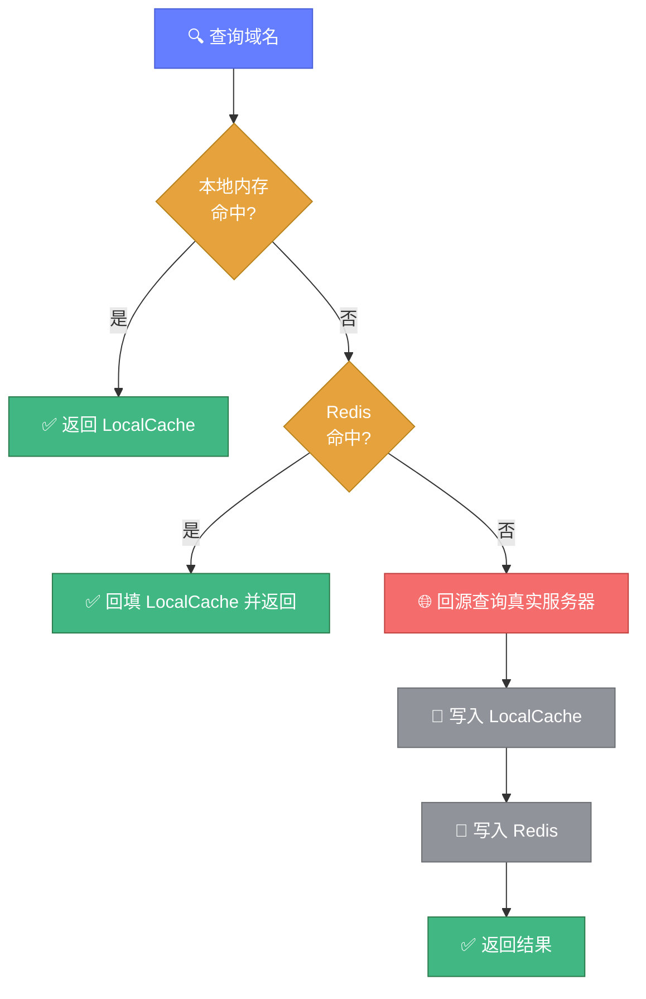
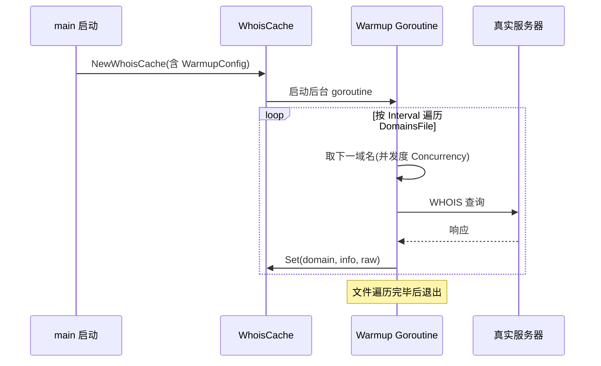

# 💾 缓存配置教程

> 📖 配置本地内存与 Redis 缓存，加速重复查询，规避高频封禁。

---

## 1️⃣ 为什么需要缓存

WHOIS 查询是网络 I/O 密集型操作，且高频查询易被注册局限速。缓存能：

- ⚡ **加速重复查询**——命中缓存直接返回，毫秒级
- 🛡️ **规避封禁**——减少对真实服务器的请求
- 📊 **统计命中率**——量化缓存效果

---

## 2️⃣ 本地内存缓存

最简单的缓存方式：

```go
cache, err := whois.NewWhoisCache(whois.DefaultCacheConfig)
// DefaultCacheConfig: Enabled:true, TTL:3600, MaxEntries:10000, CleanupInterval:300

// 写入缓存
cache.Set("example.com", info, rawResponse)

// 读取缓存
entry, ok := cache.Get("example.com")
if ok {
	fmt.Println("命中缓存，注册商:", entry.Info.Registrar.Name)
}
```

### 自定义配置

```go
config := whois.CacheConfig{
	Enabled:         true,
	Type:            "local",
	TTL:             7200,    // 缓存有效期（秒）
	MaxEntries:      50000,   // 最大条目数
	CleanupInterval: 600,     // 清理间隔（秒）
}
cache, _ := whois.NewWhoisCache(config)
```

---

## 3️⃣ Redis 缓存

分布式场景下用 Redis 共享缓存：

```go
config := whois.CacheConfig{
	Enabled: true,
	Type:    "redis",
	RedisConfig: &whois.RedisConfig{
		Addr:     "localhost:6379",
		Password: "",
		DB:       0,
		PoolSize: 10,
	},
	TTL: 3600,
}
cache, _ := whois.NewWhoisCache(config)
```

::: tip 💡 Redis key 格式
Redis 缓存 key 为 `whois:{domain}`，值为 JSON 序列化的 `CacheEntry`，TTL 由 `ExpiresAt - now` 计算。
:::

下图展示了本地/Redis 双层缓存的读写流程：



---

## 4️⃣ 缓存预热

启动时预先查询常用域名填充缓存：

```go
config := whois.CacheConfig{
	Enabled: true,
	Type:    "local",
	TTL:     3600,
	WarmupConfig: &whois.WarmupConfig{
		Enabled:     true,
		DomainsFile: "config/warmup.json", // JSON 域名列表
		Concurrency: 5,
		Interval:    1000, // 预热间隔（毫秒）
	},
}
cache, _ := whois.NewWhoisCache(config) // 启用预热则后台 goroutine 自动执行
```

`warmup.json` 格式：

```json
["example.com", "google.com", "github.com"]
```

下图展示了缓存预热的后台时序：



---

## 5️⃣ 全局单例

```go
// 获取全局缓存单例（首次失败回退本地缓存）
cache := whois.GetCache()
cache.Set("example.com", info, raw)
```

---

## 6️⃣ 清理过期

```go
// 手动清理过期条目（仅 LocalCache 有效，Redis 靠 TTL 自动过期）
cache.ClearExpired()

// 清空全部
cache.Clear()

// 删除单个
cache.Delete("example.com")
```

::: tip 🔄 后台清理
`main.go` 启动时会启动后台 goroutine，按 `CleanupInterval` 自动调用 `ClearExpired()`。
:::

---

## 7️⃣ 缓存统计

```go
stats := cache.GetStats()
fmt.Printf("命中: %d\n", stats["hits"])
fmt.Printf("未命中: %d\n", stats["misses"])
fmt.Printf("条目数: %d\n", stats["entries"])
fmt.Printf("命中率: %.2f%%\n", stats["hit_rate"])
```

---

## 8️⃣ 通过命令行启用

```bash
./bin/whois-hacker --cache --cache-type local --cache-ttl 7200 --cache-warmup --warmup-file config/warmup.json
```

或通过 `config.yaml`：

```yaml
cache:
  enabled: true
  type: local
  ttl: 7200
  warmup: true
  warmup_file: config/warmup.json
```

---

## ✅ 小结

| 场景 | 推荐 |
|------|------|
| 单机 | 本地内存缓存 |
| 分布式 | Redis |
| 冷启动慢 | 缓存预热 |
| 命中率低 | 检查 TTL 与 MaxEntries |

---

## 🔗 相关

- 💾 [cache.go API](../api/whois/cache.md)
- ⚙️ [配置系统](./configuration.md)
- 🔒 [代理 proxy.go](../api/whois/proxy.md)
