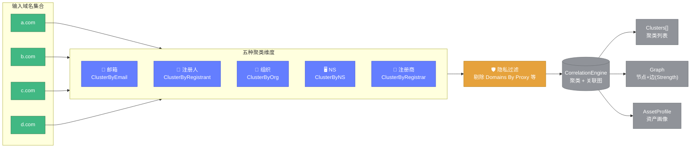

# 🔍 关联分析教程

> 📖 按邮箱/注册人/组织聚类多域名，构建关联图与资产画像。

---

## 🎯 应用场景

在情报收集与资产盘点中，常需要回答：

- 📧 "**这个邮箱注册了哪些域名？**"
- 👤 "**这个注册人还拥有哪些资产？**"
- 🏢 "**同一组织名下的域名分布？**"
- 🔗 "**这些域名之间有何关联？**"

`CorrelationEngine` 就是为此而生。

---

## 1️⃣ 基础用法

```go
package main

import (
	"fmt"

	"github.com/cyberspacesec/whois-skills/pkg/whois"
)

func main() {
	engine := whois.NewCorrelationEngine()

	// 批量查询多个域名并加入引擎
	domains := []string{"a.com", "b.com", "c.com", "d.com"}
	for _, d := range domains {
		result, err := whois.ExecuteQueryWithResult(&whois.QueryOptions{Domain: d})
		if err != nil {
			continue
		}
		engine.AddDomain(d, result.Info)
	}

	// 执行关联分析
	result := engine.Analyze()

	fmt.Printf("聚类数: %d\n", len(result.Clusters))
	fmt.Printf("关联边数: %d\n", len(result.Graph.Edges))
	for _, cluster := range result.Clusters {
		fmt.Printf("\n[%s] %s (共 %d 个域名)\n",
			cluster.Type, cluster.Key, cluster.Count)
		fmt.Printf("  域名: %v\n", cluster.Domains)
	}
}
```

---

## 2️⃣ 五种聚类维度

`AddDomain` 会按五个维度聚类：



| 维度 | 常量 | 说明 |
|------|------|------|
| 📧 邮箱 | `ClusterByEmail` | 相同注册人/管理员邮箱 |
| 👤 注册人 | `ClusterByRegistrant` | 相同注册人姓名 |
| 🏢 组织 | `ClusterByOrg` | 相同组织 |
| 🖥️ NS | `ClusterByNS` | 相同 NS（取基础域名） |
| 🏪 注册商 | `ClusterByRegistrar` | 相同注册商 |

::: tip 🛡️ 隐私过滤
引擎自动过滤隐私保护条目（如 Domains By Proxy），不会把隐私邮箱作为聚类键。详见 [quality.go](../api/whois/quality.md)。
:::

---

## 3️⃣ 聚类摘要

每个 `Cluster` 含 `Summary`：

```go
for _, cluster := range result.Clusters {
	s := cluster.Summary
	fmt.Printf("聚类: %s\n", cluster.Key)
	fmt.Printf("  常见注册人: %s\n", s.CommonRegistrant)
	fmt.Printf("  常见组织: %s\n", s.CommonOrganization)
	fmt.Printf("  常见注册商: %s\n", s.CommonRegistrar)
	fmt.Printf("  常见国家: %v\n", s.CommonCountries)
	fmt.Printf("  常见 NS: %v\n", s.CommonNameServers)
	fmt.Printf("  最早创建: %s\n", s.FirstCreated)
	fmt.Printf("  最晚创建: %s\n", s.LastCreated)
}
```

---

## 4️⃣ 关联图

`CorrelationGraph` 包含节点与边：

```go
graph := result.Graph

// 节点
for _, node := range graph.Nodes {
	fmt.Printf("节点: %s (注册人: %s)\n", node.Domain, node.Registrant)
}

// 边
for _, edge := range graph.Edges {
	fmt.Printf("边: %s → %s [%s] 强度=%d\n",
		edge.Source, edge.Target, edge.Type, edge.Strength)
}
```

边的 `Strength` 表示两个域名共享多少个聚类键，越大关联越强。

---

## 5️⃣ 资产画像

针对某个实体（邮箱/注册人/组织）生成资产画像：

```go
profile := engine.GetAssetProfile("admin@example.com", whois.ClusterByEmail)
if profile != nil {
	fmt.Printf("实体: %s (%s)\n", profile.EntityID, profile.EntityType)
	fmt.Printf("总域名数: %d\n", profile.TotalDomains)

	// 注册商分布
	for registrar, count := range profile.RegistrarDistribution {
		fmt.Printf("  注册商 %s: %d 个\n", registrar, count)
	}

	// 国家分布
	for country, count := range profile.CountryDistribution {
		fmt.Printf("  国家 %s: %d 个\n", country, count)
	}

	// TLD 分布
	for tld, count := range profile.TLDistribution {
		fmt.Printf("  TLD .%s: %d 个\n", tld, count)
	}

	fmt.Printf("时间范围: %s ~ %s\n",
		profile.TimeRange.Earliest, profile.TimeRange.Latest)
}
```

::: warning ⚠️ 仅支持三类实体
`GetAssetProfile` 仅支持 `ClusterByEmail`、`ClusterByRegistrant`、`ClusterByOrg`。
:::

---

## 6️⃣ 注册商统计

```go
stats := engine.GetRegistrarStats()
for registrar, stat := range stats {
	fmt.Printf("%s: %d 个域名, 隐私保护 %v\n",
		registrar, stat.TotalDomains, stat.PrivacyProtected)
}
```

---

## 7️⃣ HTTP API 关联

```bash
curl -X POST http://127.0.0.1:8080/api/correlation \
  -H "Content-Type: application/json" \
  -d '{"domains":["a.com","b.com","c.com"]}'
```

📖 详见 [关联端点](../api/http/endpoint-correlation.md)。

---

## 8️⃣ 完整实战：揪出同主体资产

```go
engine := whois.NewCorrelationEngine()

// 查询可疑域名集合
targets := loadTargets() // []string
for _, d := range targets {
	if r, err := whois.ExecuteQueryWithResult(&whois.QueryOptions{Domain: d}); err == nil {
		engine.AddDomain(d, r.Info)
	}
}

result := engine.Analyze()

// 找出 ≥3 个域名的邮箱聚类（高度可疑的同主体资产）
for _, c := range result.Clusters {
	if c.Type == whois.ClusterByEmail && c.Count >= 3 {
		fmt.Println("🚨 发现同主体资产群:")
		fmt.Printf("  邮箱: %s\n", c.Key)
		fmt.Printf("  域名: %v\n", c.Domains)
		profile := engine.GetAssetProfile(c.Key, whois.ClusterByEmail)
		fmt.Printf("  TLD 分布: %v\n", profile.TLDistribution)
	}
}
```

---

## ✅ 小结

| 需求 | 方法 |
|------|------|
| 加入域名 | `AddDomain` |
| 执行分析 | `Analyze` |
| 资产画像 | `GetAssetProfile` |
| 注册商统计 | `GetRegistrarStats` |

---

## 🔗 下一步

- 🔗 [correlation.go API](../api/whois/correlation.md)
- ⭐ [质量评估](../api/whois/quality.md)
- 📊 [差异对比 diff](../api/whois/diff.md)
