# 🎯 域名查询教程

> 📖 从零掌握域名 WHOIS 查询，覆盖单查、并发、校验、IDN、导出。

---

## 1️⃣ 最简单的查询

```go
package main

import (
	"fmt"

	"github.com/cyberspacesec/whois-skills/pkg/whois"
)

func main() {
	info, err := whois.Execute(&whois.Query{Domain: "example.com"})
	if err != nil {
		panic(err)
	}
	fmt.Printf("注册商: %s\n", info.Registrar.Name)
}
```

`Execute` 是旧版兼容 API，内部委托给 `ExecuteQueryWithContext`。

下图展示了域名 WHOIS 查询的完整数据流（输入→查询→解析→输出）：

```mermaid
flowchart LR
    In["📝 输入 Domain<br/>example.com"] --> Norm["🌐 IDN 规范化<br/>NormalizeDomain"]
    Norm --> Q{"FollowReferral?"}
    Q -->|是| R1["🔍 查询注册局引导<br/>whois.iana.org"]
    R1 --> R2["🔗 跟随到注册商服务器"]
    Q -->|否| R2
    R2 --> Fetch["📡 拉取原始响应<br/>代理/重试/限速"]
    Fetch --> Parse["📋 解析为 WhoisInfo<br/>whois-parser"]
    Parse --> Valid{"校验完整性?"}
    Valid -->|失败| Miss["⚠️ 报告缺失字段"]
    Valid -->|通过| Out["✅ QueryResult<br/>含延迟/原始响应/重试次数"]
    Miss --> Out

    classDef in fill:#41b883,color:#fff,stroke:#2b7a4b
    classDef act fill:#647eff,color:#fff,stroke:#4a5fd6
    classDef check fill:#e6a23c,color:#fff,stroke:#b7821c
    classDef out fill:#41b883,color:#fff,stroke:#2b7a4b
    classDef err fill:#f56c6c,color:#fff,stroke:#c04040
    class In in
    class Norm,R1,R2,Fetch,Parse act
    class Q,Valid check
    class Miss err
    class Out out
```



---

## 2️⃣ 完整结果查询（推荐）

`ExecuteQueryWithResult` 返回原始响应、延迟、重试次数、校验结果：

```go
result, err := whois.ExecuteQueryWithResult(&whois.QueryOptions{
	Domain:     "example.com",
	Timeout:    10,
	MaxRetries: 5,
})
if err != nil {
	panic(err)
}

fmt.Printf("服务器: %s\n", result.Server)
fmt.Printf("延迟: %d ms\n", result.Latency)
fmt.Printf("原始响应:\n%s\n", result.RawResponse)
```

### QueryOptions 字段

| 字段 | 类型 | 默认 | 说明 |
|------|------|------|------|
| `Domain` | string | - | 域名（必填） |
| `IntervalMils` | int | 1000 | 重试间隔（毫秒） |
| `MaxRetries` | int | 5 | 最大重试次数 |
| `UseProxy` | bool | false | 是否走代理 |
| `Priority` | int | - | 1-10，越小越优先（聚合器用） |
| `Timeout` | int | 10 | 超时（秒） |
| `ValidateResult` | bool | false | 是否校验结果完整性 |
| `RequiredFields` | []string | - | 必填字段（校验用） |
| `FollowReferral` | bool | true | 是否跟随引导 |
| `MaxReferrals` | int | 3 | 最大引导次数 |

---

## 3️⃣ 结果校验

开启 `ValidateResult` 并指定 `RequiredFields`，校验失败会在 `ValidationResult` 中报告：

```go
result, _ := whois.ExecuteQueryWithResult(&whois.QueryOptions{
	Domain:         "example.com",
	ValidateResult: true,
	RequiredFields: []string{"registrar", "registrant_email", "expiration_date"},
})

vr := result.ValidationResult
if !vr.Valid {
	fmt.Println("校验失败，缺失字段:", vr.MissingFields)
	fmt.Println("错误:", vr.Errors)
}
```

---

## 4️⃣ 并发批量查询

用 `QueryAggregator` + 优先级队列并发查询多个域名：

```go
agg := whois.NewQueryAggregator(whois.AggregatorConfig{
	Concurrency: 10,
	ProgressCallback: func(completed, total int, domain string, result *whois.QueryResult, err error) {
		fmt.Printf("[%d/%d] %s 完成\n", completed, total, domain)
	},
})

// 优先级越小越先查
agg.AddQuery("important.com", &whois.QueryOptions{Domain: "important.com", Priority: 1})
agg.AddQuery("normal.org", &whois.QueryOptions{Domain: "normal.org", Priority: 5})
agg.AddQuery("low.io", &whois.QueryOptions{Domain: "low.io", Priority: 10})

batch := agg.ExecuteAll()
fmt.Printf("成功: %d, 失败: %d\n", batch.Stats.SuccessfulQueries, batch.Stats.FailedQueries)

for domain, result := range batch.Results {
	fmt.Printf("%s → %s\n", domain, result.Info.Registrar.Name)
}
```

### 统计信息

```go
stats := agg.GetStats()
fmt.Printf("平均延迟: %d ms\n", stats.AvgLatency)
fmt.Printf("最大延迟: %d ms\n", stats.MaxLatency)
fmt.Printf("校验失败: %d\n", stats.ValidationFailures)
```

::: tip 📋 大规模批量
对于成百上千的域名，推荐使用 [流式批量处理器 batch.go](../api/whois/batch.md)，支持断点续查。
:::

---

## 5️⃣ IDN 国际化域名

查询中文等多语言域名前，应先规范化：

```go
normalized, _ := whois.NormalizeDomain("https://例.测试/path")
// normalized == "xn--fsq.xn--3est"

result, _ := whois.ExecuteQueryWithResult(&whois.QueryOptions{
	Domain: normalized,
})
```

其他 IDN 工具：

```go
// 检测是否为 IDN
whois.IsIDN("xn--fsq.xn--3est") // true

// Unicode → Punycode
puny, _ := whois.UnicodeToPunycode("例.测试")

// Punycode → Unicode
uni, _ := whois.PunycodeToUnicode("xn--fsq.xn--3est")
```

📖 详见 [IDN 文档](../api/whois/idn.md)。

---

## 6️⃣ 导出结果

将查询结果导出为 JSON/CSV/Markdown：

```go
result, _ := whois.ExecuteQueryWithResult(&whois.QueryOptions{Domain: "example.com"})

// 导出 JSON
var buf bytes.Buffer
whois.ExportToJSON(result.Info, &buf)
os.WriteFile("example.json", buf.Bytes(), 0644)

// 导出 CSV
whois.ExportToCSV(result.Info, &buf)

// 导出 Markdown
whois.ExportToMarkdown(result.Info, &buf)
```

📖 详见 [导出文档](../api/whois/export.md)。

---

## 7️⃣ 启用代理查询

规避高频查询限制：

```go
// 加载代理列表
whois.LoadProxiesFromFile("config/proxies.json")

result, _ := whois.ExecuteQueryWithResult(&whois.QueryOptions{
	Domain:   "example.com",
	UseProxy: true,
})
fmt.Println("使用代理:", result.UsedProxy)
```

📖 详见 [代理文档](../api/whois/proxy.md)。

---

## ✅ 小结

| 需求 | 推荐方式 |
|------|---------|
| 单次简单查询 | `Execute` |
| 单次完整查询 | `ExecuteQueryWithResult` |
| 少量并发（<100） | `QueryAggregator` |
| 大规模批量 | `StreamBatchProcessor` |
| 国际域名 | `NormalizeDomain` 预处理 |
| 规避封禁 | `UseProxy=true` |

---

## 🔗 下一步

- 🌐 [IP 查询教程](./tutorial-ip.md)
- 🔎 [query.go 完整 API](../api/whois/query.md)
- 📋 [批量查询教程](./tutorial-batch.md)
