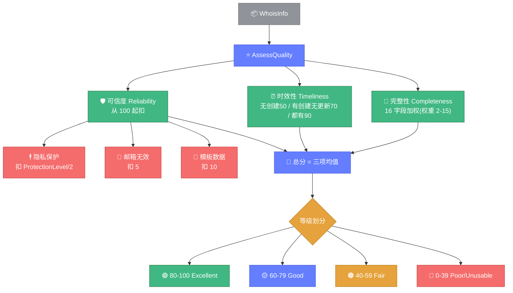

# ⭐ 数据质量教程

> 📖 评估 WHOIS 数据的完整性、时效性、可信度，检测隐私保护。

---

## 1️⃣ 为什么评估质量

WHOIS 数据质量参差不齐：
- 🕳️ **字段缺失**——部分注册人不填邮箱/电话
- 🕴️ **隐私保护**——Domains By Proxy 等隐藏真实信息
- 📝 **模板数据**——填写 "n/a"、"test"、"example" 等占位
- ⏰ **数据陈旧**——长期未更新

`AssessQuality` 帮你量化这些问题。

---

## 2️⃣ 基础评估

```go
package main

import (
	"fmt"

	"github.com/cyberspacesec/whois-skills/pkg/whois"
)

func main() {
	result, err := whois.ExecuteQueryWithResult(&whois.QueryOptions{Domain: "example.com"})
	if err != nil {
		panic(err)
	}

	score := whois.AssessQuality(result.Info)

	fmt.Printf("总分: %d\n", score.Total)
	fmt.Printf("等级: %s\n", score.Level)
	fmt.Printf("完整性: %d\n", score.Completeness)
	fmt.Printf("时效性: %d\n", score.Timeliness)
	fmt.Printf("可信度: %d\n", score.Reliability)
	fmt.Printf("缺失字段: %v\n", score.MissingFields)
}
```

---

## 3️⃣ 三维评分

### 完整性 Completeness

按 16 个字段加权评分（权重 2-15）：

| 字段 | 权重 |
|------|------|
| domain | 15 |
| created / expiration / registrar_name / registrant_name / email | 8-10 |
| 注册商邮箱 / 组织 | 3-5 |
| 技术联系人 | 2 |

### 时效性 Timeliness

| 情况 | 得分 |
|------|------|
| 无创建日期 | 50 |
| 有创建无更新 | 70 |
| 创建与更新都有 | 90 |

### 可信度 Reliability

从 100 起扣分：
- 🕴️ 隐私保护：扣 `ProtectionLevel / 2`
- 📧 邮箱无效：扣 5
- 📝 模板数据：扣 10

**总分** = 三项均值。

下图展示了三维评分模型的结构与扣分/加分逻辑：



---

## 4️⃣ 质量等级

| 总分 | 等级 | 说明 |
|------|------|------|
| 80-100 | `QualityLevelExcellent` | 优秀 |
| 60-79 | `QualityLevelGood` | 良好 |
| 40-59 | `QualityLevelFair` | 一般 |
| 20-39 | `QualityLevelPoor` | 较差 |
| 0-19 | `QualityLevelUnusable` | 不可用 |

---

## 5️⃣ 隐私保护检测

```go
score := whois.AssessQuality(info)
if score.PrivacyDetection != nil && score.PrivacyDetection.HasPrivacy {
	fmt.Println("🛡️ 检测到隐私保护")
	fmt.Printf("Provider: %s\n", score.PrivacyDetection.Provider)
	fmt.Printf("类型: %v\n", score.PrivacyDetection.Types)
	fmt.Printf("保护级别: %d\n", score.PrivacyDetection.ProtectionLevel)
	fmt.Printf("受保护字段: %v\n", score.PrivacyDetection.ProtectedFields)
}
```

内置 13 条隐私服务商规则：Domains By Proxy、WHOIS Privacy、Contact Privacy、DATA PROTECTED、GDPR Redacted、Perfect Privacy、eName、Pantheon、Registration Private、Withheld for Privacy、ID Protect、Digital Privacy 等。

---

## 6️⃣ 质量问题清单

```go
for _, issue := range score.Issues {
	fmt.Printf("[%s] %s (字段: %s, 严重度: %s)\n",
		issue.Type, issue.Description, issue.Field, issue.Severity)
}
```

IssueType 取值：`IssueMissingField` / `IssuePrivacyProtected` / `IssueInvalidFormat` / `IssueStaleData` / `IssueDuplicateData` / `IssueRedactedData`。

---

## 7️⃣ 字段规范化

`NormalizeContactField` 规范化联系人字段，供关联分析复用：

```go
whois.NormalizeContactField("  John  DOE ", "name")      // "John Doe"
whois.NormalizeContactField("john@@example.com", "email") // 校验
whois.NormalizeContactField("+86-138-0000-0000", "phone") // "86-138-0000-0000"
whois.NormalizeContactField("US", "country")              // "US"
```

---

## 8️⃣ 批量质量筛选

```go
domains := []string{"a.com", "b.com", "c.com"}
for _, d := range domains {
	result, err := whois.ExecuteQueryWithResult(&whois.QueryOptions{Domain: d})
	if err != nil {
		continue
	}
	score := whois.AssessQuality(result.Info)
	if score.Total < 40 {
		fmt.Printf("⚠️ %s 质量较差 (%d, %s)\n", d, score.Total, score.Level)
	}
}
```

---

## 9️⃣ HTTP API 调用

```bash
curl -X POST http://127.0.0.1:8080/api/quality \
  -H "Content-Type: application/json" \
  -d '{"domain":"example.com"}'
```

📖 详见 [质量端点](../api/http/endpoint-quality.md)。

---

## ✅ 小结

| 需求 | 方法 |
|------|------|
| 综合评分 | `AssessQuality` |
| 隐私检测 | `score.PrivacyDetection` |
| 问题清单 | `score.Issues` |
| 字段规范化 | `NormalizeContactField` |

---

## 🔗 相关

- ⭐ [quality.go API](../api/whois/quality.md)
- 🔗 [关联分析教程](./tutorial-correlation.md)
- 📊 [差异对比 diff](../api/whois/diff.md)
