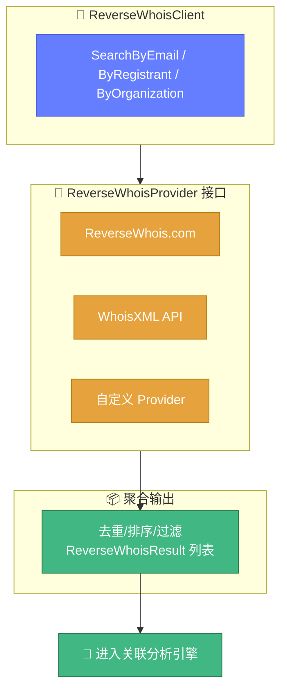

# 🔄 反向查询教程

> 📖 按注册人邮箱、组织、姓名反向检索关联域名。

---

## 1️⃣ 什么是反向 WHOIS

正向 WHOIS：**域名 → 注册信息**
反向 WHOIS：**注册信息 → 域名列表**

应用场景：
- 🕵️ **资产盘点**——某组织名下所有域名
- 🚨 **威胁情报**——某可疑邮箱注册了哪些域名
- 🔗 **关联发现**——同一注册人的资产群

---

## 2️⃣ Provider 接口

`reverse.go` 是抽象层，定义 `ReverseWhoisProvider` 接口，需自行实现对接第三方服务：

```go
type ReverseWhoisProvider interface {
	SearchByRegistrant(ctx, query, opts) ([]*ReverseWhoisResult, error)
	SearchByEmail(ctx, email, opts) ([]*ReverseWhoisResult, error)
	SearchByOrganization(ctx, org, opts) ([]*ReverseWhoisResult, error)
	Name() string
}
```

::: warning ⚠️ 需自实现
反向 WHOIS 数据通常由第三方付费服务提供（如 ReverseWhois.com、WhoisXML API），需实现 Provider 对接。
:::

---

## 3️⃣ 实现 Provider

```go
type MyProvider struct{}

func (p *MyProvider) SearchByEmail(ctx context.Context, email string, opts *whois.ReverseWhoisOptions) ([]*whois.ReverseWhoisResult, error) {
	// 调用第三方 API，返回结果
	return []*whois.ReverseWhoisResult{
		{Domain: "a.com", Email: email, Registrar: "GoDaddy"},
		{Domain: "b.com", Email: email, Registrar: "Namecheap"},
	}, nil
}

func (p *MyProvider) SearchByRegistrant(ctx context.Context, query string, opts *whois.ReverseWhoisOptions) ([]*whois.ReverseWhoisResult, error) { /* ... */ }
func (p *MyProvider) SearchByOrganization(ctx context.Context, org string, opts *whois.ReverseWhoisOptions) ([]*whois.ReverseWhoisResult, error) { /* ... */ }
func (p *MyProvider) Name() string { return "my-provider" }
```

---

## 4️⃣ 使用客户端

```go
client := whois.NewReverseWhoisClient(&MyProvider{})

opts := &whois.ReverseWhoisOptions{
	Limit:          100,
	IncludeExpired: false,
}

// 按邮箱反查
results, err := client.SearchByEmail(ctx, "admin@example.com", opts)
for _, r := range results {
	fmt.Printf("%s (注册商: %s, 创建: %s)\n", r.Domain, r.Registrar, r.CreationDate)
}

// 按组织反查
results, _ = client.SearchByOrganization(ctx, "Example Inc", opts)

// 按注册人姓名反查
results, _ = client.SearchByRegistrant(ctx, "John Doe", opts)

fmt.Println("Provider:", client.ProviderName())
```

### ReverseWhoisResult 结构

```go
type ReverseWhoisResult struct {
	Domain         string
	Registrant     string
	Email          string
	Organization   string
	CreationDate   string
	ExpirationDate string
	Registrar      string
}
```

下图展示了反向 WHOIS 的 Provider 抽象与多源聚合结构：



---

## 5️⃣ 反查 + 关联分析

反查结果可继续用关联分析引擎深挖：

```go
client := whois.NewReverseWhoisClient(&MyProvider{})
results, _ := client.SearchByEmail(ctx, "admin@example.com", &whois.ReverseWhoisOptions{Limit: 100})

engine := whois.NewCorrelationEngine()
for _, r := range results {
	if info, err := whois.ExecuteQueryWithResult(&whois.QueryOptions{Domain: r.Domain}); err == nil {
		engine.AddDomain(r.Domain, info.Info)
	}
}
analysis := engine.Analyze()
// 找出这些域名间的其他关联维度（NS、注册商等）
```

📖 详见 [关联分析教程](./tutorial-correlation.md)。

---

## ✅ 小结

| 需求 | 方法 |
|------|------|
| 邮箱反查 | `SearchByEmail` |
| 组织反查 | `SearchByOrganization` |
| 注册人反查 | `SearchByRegistrant` |
| 限制数量 | `opts.Limit` |
| 含过期域名 | `opts.IncludeExpired = true` |

---

## 🔗 相关

- 🔄 [reverse.go API](../api/whois/reverse.md)
- 🔗 [关联分析教程](./tutorial-correlation.md)
- 🔗 [correlation.go API](../api/whois/correlation.md)
