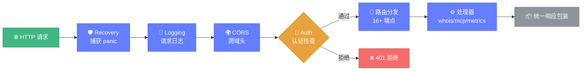

# 🌐 api 模块 — HTTP 服务核心

> 📖 `pkg/api` 基于 Go 标准 `net/http` 提供 HTTP API 服务，封装 WHOIS/IP/ASN/RDAP/批量/格式化/导出/系统等 16+ 端点，内置认证、CORS、日志、恢复中间件链。

---

## 📋 概览

| 项目 | 内容 |
|------|------|
| 路径 | `pkg/api` |
| 源文件数 | 3（另有 3 个 `_test.go`） |
| 职责 | HTTP 路由、请求处理、中间件链、批量会话管理 |
| 依赖 | `pkg/whois`、`pkg/mcp`、`pkg/metrics` |

---

## 📁 文件清单

| 文件 | 职责 |
|------|------|
| `server.go` | `Server` 结构、路由注册、全部端点处理器、批量会话、MCP 路由注册 |
| `middleware.go` | 认证、CORS、日志、恢复中间件 |
| `response.go` | 统一响应包装（`SendSuccessResponse`/`SendErrorResponse`） |

---

## 🏗️ Server 结构

```go
type Server struct {
    Host string
    Port int
    // 功能开关
    EnableProxy   bool
    EnableCache   bool
    EnableMetrics bool
    EnableAlerts  bool
    // 自定义中间件
    middlewares []func(http.Handler) http.Handler
    // 批量查询会话
    batchSessions sync.Map
}
```

### 核心方法

| 方法 | 说明 |
|------|------|
| `NewServer(host, port) *Server` | 创建服务器 |
| `Start() error` | 直接启动（内部 `ListenAndServe`） |
| `CreateHandler() http.Handler` | 创建含全部路由与中间件的处理器，可供外部 `http.Server` 使用 |
| `AddMiddleware(mw)` | 追加自定义中间件 |

::: tip 💡 推荐用 CreateHandler
`cmd` 入口使用 `CreateHandler()` 配合自建 `http.Server`，以支持优雅关闭（`Shutdown`）。
:::

---

## 🔗 中间件链

`addMiddleware` 按以下顺序包裹（外层先执行），请求依次穿透中间件链到达路由处理器，响应再沿原路返回：



`addMiddleware` 按以下顺序包裹（外层先执行）：

1. **RecoveryMiddleware** — 捕获 panic，返回 500
2. **LoggingMiddleware** — 记录请求日志
3. **CORSMiddleware** — 跨域头
4. **AuthMiddleware** — 认证（⚠️ 当前为占位实现，见注意事项）
5. 自定义中间件

---

## 🌍 端点一览（16+）

### WHOIS 核心查询

| 端点 | 方法 | 说明 |
|------|------|------|
| `/api/whois` | POST | 域名 WHOIS 查询 |
| `/api/ip` | POST | IP WHOIS 查询 |
| `/api/asn` | POST | ASN 查询 |

### RDAP 查询

| 端点 | 方法 | 说明 |
|------|------|------|
| `/api/rdap/domain` | POST | RDAP 域名查询 |
| `/api/rdap/ip` | POST | RDAP IP 查询 |
| `/api/rdap/asn` | POST | RDAP ASN 查询 |

### 域名分析

| 端点 | 方法 | 说明 |
|------|------|------|
| `/api/availability` | POST | 域名可用性检查 |
| `/api/diff` | POST | WHOIS 对比 |
| `/api/quality` | POST | 质量评估 |
| `/api/correlation` | POST | 关联分析 |

### 批量查询

| 端点 | 方法 | 说明 |
|------|------|------|
| `/api/batch` | POST | 启动批量查询（异步，返回 session_id） |
| `/api/batch/status` | GET | 查询批量进度（`?id=`） |

### 格式化与导出

| 端点 | 方法 | 说明 |
|------|------|------|
| `/api/format` | POST | 原始响应格式化 |
| `/api/export/json` | POST | 导出 JSON |
| `/api/export/csv` | POST | 导出 CSV |
| `/api/export/markdown` | POST | 导出 Markdown |

### IDN 与工具

| 端点 | 方法 | 说明 |
|------|------|------|
| `/api/idn` | POST | IDN 转换 |
| `/api/servers` | GET | WHOIS 服务器列表 |

### 系统

| 端点 | 方法 | 说明 |
|------|------|------|
| `/api/metrics` | GET | 指标（需 `EnableMetrics`） |
| `/api/alerts` | GET | 告警历史（需 `EnableAlerts`） |
| `/api/health` | GET | 健康检查 |

### MCP（10 端点，见 mcp 模块）

通过 `registerMCPRoutes` 注册到 `/api/mcp/*`。

---

## 🚀 使用示例

```go
srv := api.NewServer("0.0.0.0", 8080)
srv.EnableMetrics = true
httpServer := &http.Server{
    Addr:    ":8080",
    Handler: srv.CreateHandler(),
}
httpServer.ListenAndServe()
```

---

## ⚠️ 注意事项

- `AuthMiddleware` 当前是**占位实现**（`// TODO: 实现认证逻辑`），真实认证请使用 [security 模块](./security.md) 的 `AuthMiddleware(requiredPermission)`。
- 大多数查询端点仅接受 `POST` + JSON body，`/api/batch/status`、`/api/servers`、系统端点为 `GET`。
- `/api/metrics`、`/api/alerts` 在功能开关关闭时返回 **503**。

---

## 🔗 相关链接

- [HTTP API 总览](../api/http/overview.md)
- [mcp 模块](./mcp.md)
- [模块总览](./overview.md)
