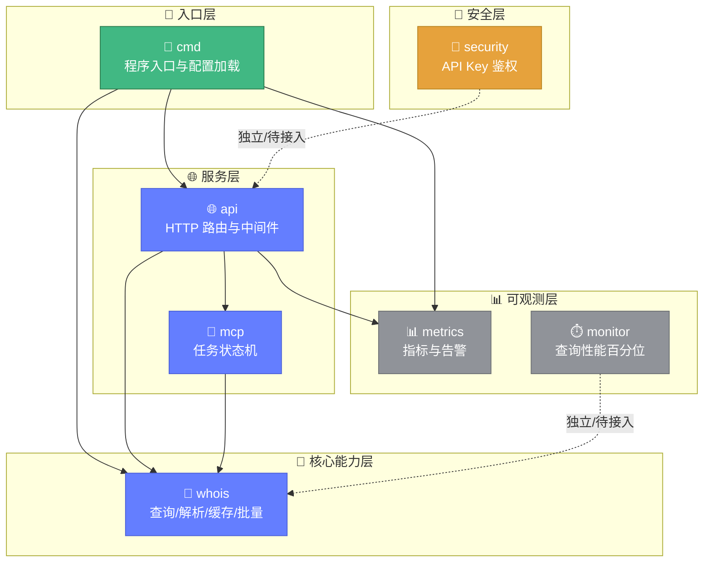

# 🧩 模块总览

> 📖 whois-skills 由 `pkg/` 下 6 个功能模块与 `cmd/` 入口模块组成，各模块职责清晰、边界明确，可独立使用或组合成完整的 HTTP 服务。

---

## 📋 模块全景

| 模块 | 路径 | 源文件 | 职责 | 状态 |
|------|------|--------|------|------|
| [whois](./whois.md) | `pkg/whois` | 24 | 核心查询能力库（域名/IP/ASN/RDAP/批量/关联/监控等） | ✅ 核心 |
| [api](./api.md) | `pkg/api` | 3 | HTTP API 服务（16+ 端点） | ✅ 稳定 |
| [mcp](./mcp.md) | `pkg/mcp` | 3 | MCP 任务状态机 + WHOIS 查询能力 | ✅ 稳定 |
| [metrics](./metrics.md) | `pkg/metrics` | 4 | 指标采集 + 告警 + 通知器 | ✅ 稳定 |
| [monitor](./monitor.md) | `pkg/monitor` | 1 | WHOIS 查询性能监控 | ⚠️ 待接入 |
| [security](./security.md) | `pkg/security` | 3 + config | API Key 管理与认证中间件 | ⚠️ 待接入 |
| [cmd](./cmd.md) | `cmd/whois-hacker` | 2 | 程序入口与配置加载 | ✅ 稳定 |

---

## 🗂️ 模块卡片

<div class="feature-card">
<h3>🔎 whois — 核心能力库</h3>
<p><strong>路径：</strong><code>pkg/whois</code>　<strong>源文件：</strong>24 个</p>
<p>查询、解析、缓存、代理、批量、关联、监控、调度等全部核心能力。可作为纯库直接 <code>import</code> 使用，无需启动服务。</p>
<p><a href="./whois.md">📖 模块详解</a> ｜ <a href="../api/whois/overview.md">🔌 API 文档</a></p>
</div>

<div class="feature-card">
<h3>🌐 api — HTTP 服务</h3>
<p><strong>路径：</strong><code>pkg/api</code>　<strong>源文件：</strong>3 个</p>
<p>基于标准 <code>net/http</code> 的 HTTP API 服务，提供 WHOIS/IP/ASN/RDAP/批量/格式化/导出/系统等 16+ 端点，内置中间件链。</p>
<p><a href="./api.md">📖 模块详解</a> ｜ <a href="../api/http/overview.md">🔌 API 文档</a></p>
</div>

<div class="feature-card">
<h3>🤖 mcp — 任务编排</h3>
<p><strong>路径：</strong><code>pkg/mcp</code>　<strong>源文件：</strong>3 个</p>
<p>Model Context Protocol 任务状态机，管理 Request/Task 生命周期，并封装 WHOIS 查询能力，10 个 HTTP 端点。</p>
<p><a href="./mcp.md">📖 模块详解</a> ｜ <a href="../api/mcp/overview.md">🔌 API 文档</a></p>
</div>

<div class="feature-card">
<h3>📊 metrics — 监控告警</h3>
<p><strong>路径：</strong><code>pkg/metrics</code>　<strong>源文件：</strong>4 个</p>
<p>采集 API/WHOIS/缓存/系统四类指标，4 条默认告警规则，支持 Email/Slack/Webhook 通知，基于 gopsutil。</p>
<p><a href="./metrics.md">📖 模块详解</a></p>
</div>

<div class="feature-card">
<h3>⏱️ monitor — 性能监控</h3>
<p><strong>路径：</strong><code>pkg/monitor</code>　<strong>源文件：</strong>1 个</p>
<p>WHOIS 查询性能监控器，P90/P95/P99 百分位统计，<code>WithPerformanceMonitoring</code> 装饰器。当前独立，需查询层主动调用。</p>
<p><a href="./monitor.md">📖 模块详解</a></p>
</div>

<div class="feature-card">
<h3>🔐 security — 认证鉴权</h3>
<p><strong>路径：</strong><code>pkg/security</code>　<strong>源文件：</strong>3 个 + config</p>
<p>API Key 生成/验证/权限/速率限制，<code>AuthMiddleware</code> 工厂与请求日志。注意：尚未接入主服务器（api 模块用的是占位中间件）。</p>
<p><a href="./security.md">📖 模块详解</a></p>
</div>

<div class="feature-card">
<h3>🚀 cmd — 程序入口</h3>
<p><strong>路径：</strong><code>cmd/whois-hacker</code>　<strong>源文件：</strong>2 个</p>
<p>程序入口，17 个命令行 flag，配置优先级「命令行 > YAML > 默认」，负责初始化与优雅关闭。</p>
<p><a href="./cmd.md">📖 模块详解</a></p>
</div>

---

## 🔗 模块依赖关系

```
                    ┌─────────────┐
                    │  cmd/whois-  │
                    │   hacker    │
                    └──────┬──────┘
            ┌──────────────┼──────────────┐
            ▼              ▼              ▼
        ┌───────┐      ┌───────┐      ┌────────┐
        │  api  │      │metrics│      │ whois  │
        └───┬───┘      └───┬───┘      └────┬───┘
            │              │               │
       ┌────┴────┐         │        ┌──────┴──────┐
       ▼         ▼         │        ▼             │
    ┌─────┐  ┌──────┐      │   ┌─────────┐   ┌───┴────┐
    │ mcp │  │whois │──────┘   │ monitor │   │security│
    └──┬──┘  └──┬───┘          └─────────┘   └────────┘
       │        │                  (独立)        (独立)
       └────────┘
```

文字版依赖说明：

- `cmd` 依赖 `api`、`metrics`、`whois`
- `api` 依赖 `mcp`、`metrics`、`whois`（认证用占位中间件，未接 `security`）
- `mcp` 依赖 `whois`
- `metrics` 独立，仅被 `api`/`cmd` 调用
- `monitor` 独立，当前未被任何模块直接调用
- `security` 独立，当前未被主服务调用

下面以模块职责为维度，呈现七大模块的分层关系与调用方向：



::: warning ⚠️ 待接入的模块
`monitor` 与 `security` 目前是独立可用的库，但尚未接入主 HTTP 服务流程。使用时需在查询层主动调用 `monitor`，或将 `api` 模块的占位 `AuthMiddleware` 替换为 `security.AuthMiddleware`。
:::

---

## 📚 相关链接

- [快速开始](../guide/getting-started.md)
- [HTTP API 总览](../api/http/overview.md)
- [WHOIS 能力总览](../api/whois/overview.md)
- [MCP 协议总览](../api/mcp/overview.md)
