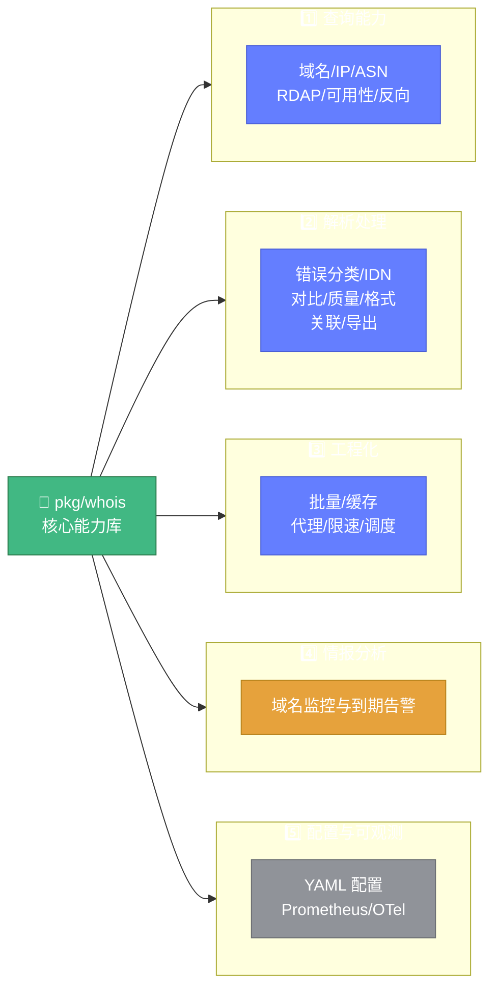

# 🔎 whois 模块 — 核心能力库

> 📖 `pkg/whois` 是 whois-skills 的核心能力库，涵盖查询、解析、缓存、代理、批量、关联分析、监控调度等全部功能，可作为纯库直接 `import` 使用，无需启动 HTTP 服务。

---

## 📋 概览

| 项目 | 内容 |
|------|------|
| 路径 | `pkg/whois` |
| 源文件数 | 24（另有 24 个 `_test.go`） |
| 职责 | WHOIS 查询、解析、缓存、代理、批量、关联、监控、调度、配置、可观测 |
| 依赖 | `whoisparser`、`golang.org/x/net/idna`、`go-domain-util` 等 |
| 包名 | `github.com/cyberspacesec/whois-skills/pkg/whois` |

::: tip 💡 作为纯库使用
whois 模块不依赖任何 HTTP 框架，所有能力以包级函数或可实例化结构体形式暴露，可直接在自己的项目中调用。
:::

---

## 📁 文件清单（5 大类）

whois 核心包 24 个源文件按职责划分为五大类，结构如下：



### 1️⃣ 查询能力

| 文件 | 能力 | 入口函数 |
|------|------|----------|
| [query.go](../api/whois/query.md) | 域名 WHOIS 查询、重试、优先级聚合 | `ExecuteQueryWithResultContext` |
| [ipwhois.go](../api/whois/ipwhois.md) | IP WHOIS 查询 | `QueryIPWithContext` |
| [ipparser.go](../api/whois/ipparser.md) | IP WHOIS 响应解析（5 大 RIR） | `ParseIPWhois` |
| [asn.go](../api/whois/asn.md) | ASN → IP 段查询（RADB） | `GetIPRangesByASN` |
| [asn_enhanced.go](../api/whois/asn-enhanced.md) | 增强 ASN 查询（RDAP+BGP） | `QueryASNWithContext` |
| [rdap.go](../api/whois/rdap.md) | RDAP 查询（域名/IP/ASN） | `QueryRDAPWithContext` |
| [availability.go](../api/whois/availability.md) | 域名可用性检查 | `CheckDomainAvailabilityWithContext` |
| [reverse.go](../api/whois/reverse.md) | 反向 WHOIS 查询 | `NewReverseWhoisClient` |
| [servers.go](../api/whois/servers.md) | WHOIS 服务器管理与健康检查 | `GetServerManager` |

### 2️⃣ 解析处理

| 文件 | 能力 | 入口函数 |
|------|------|----------|
| [errors.go](../api/whois/errors.md) | 错误分类与可重试判断 | `CheckError` |
| [idn.go](../api/whois/idn.md) | IDN/Punycode 转换与规范化 | `NormalizeDomain` |
| [diff.go](../api/whois/diff.md) | WHOIS 信息对比 | `CompareWhois` |
| [quality.go](../api/whois/quality.md) | 数据质量评估与隐私检测 | `AssessQuality` |
| [format.go](../api/whois/format.md) | 原始响应格式检测与格式化 | `DetectWhoisFormat` |
| [correlation.go](../api/whois/correlation.md) | 多域名关联分析与图谱 | `NewCorrelationEngine` |
| [export.go](../api/whois/export.md) | 导出 JSON/CSV/Markdown | `ExportToJSON` |

### 3️⃣ 工程化

| 文件 | 能力 | 入口函数 |
|------|------|----------|
| [batch.go](../api/whois/batch.md) | 流式批量查询与断点续传 | `NewStreamBatchProcessor` |
| [cache.go](../api/whois/cache.md) | 本地/Redis 缓存与预热 | `NewWhoisCache` |
| [proxy.go](../api/whois/proxy.md) | 代理池与自定义拨号 | `GetProxyPool` |
| [ratelimit.go](../api/whois/ratelimit.md) | 令牌桶限速器 | `NewRateLimiter` |
| [scheduler.go](../api/whois/scheduler.md) | 智能调度与自适应限速 | `NewSmartScheduler` |

### 4️⃣ 情报分析

| 文件 | 能力 | 入口函数 |
|------|------|----------|
| [monitor.go](../api/whois/monitor.md) | 域名监控与到期告警 | `NewDomainMonitor` |

### 5️⃣ 配置与可观测

| 文件 | 能力 | 入口函数 |
|------|------|----------|
| [config.go](../api/whois/config.md) | 库级配置与 YAML 加载 | `LoadYAMLConfig` |
| [observability.go](../api/whois/observability.md) | 指标提供者（Prometheus/OTel） | `NewCompositeMetrics` |

---

## 🚀 快速使用

```go
import "github.com/cyberspacesec/whois-skills/pkg/whois"

// 1. 单次域名查询
result, err := whois.ExecuteQueryWithResult(&whois.QueryOptions{
    Domain:     "example.com",
    Timeout:    10,
    MaxRetries: 5,
})

// 2. IP WHOIS
ipResult, err := whois.QueryIPWithContext(ctx, &whois.IPWhoisOptions{IP: "8.8.8.8"})

// 3. 批量查询
processor := whois.NewStreamBatchProcessor(whois.DefaultStreamBatchConfig())
processor.Process(ctx, []string{"a.com", "b.com"})

// 4. 关联分析
engine := whois.NewCorrelationEngine()
engine.AddDomain("a.com", info1)
result := engine.Analyze()
```

---

## 🔗 相关链接

- [WHOIS 能力总览](../api/whois/overview.md)
- [HTTP API 总览](../api/http/overview.md)
- [模块总览](./overview.md)
